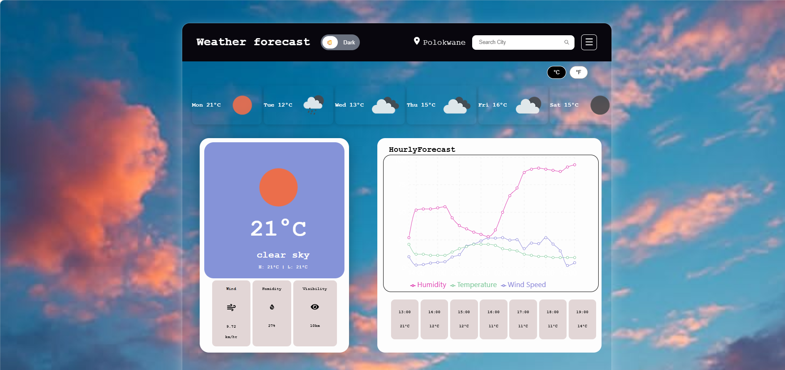
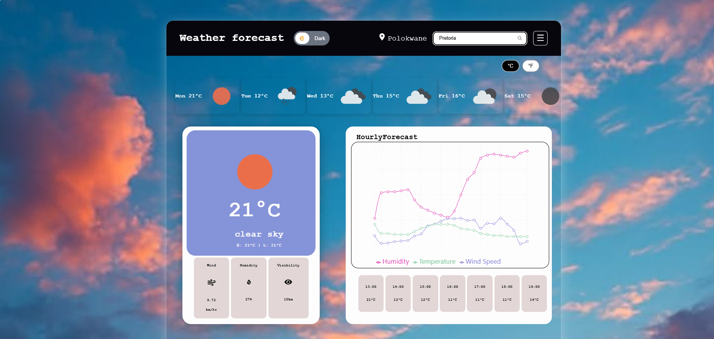
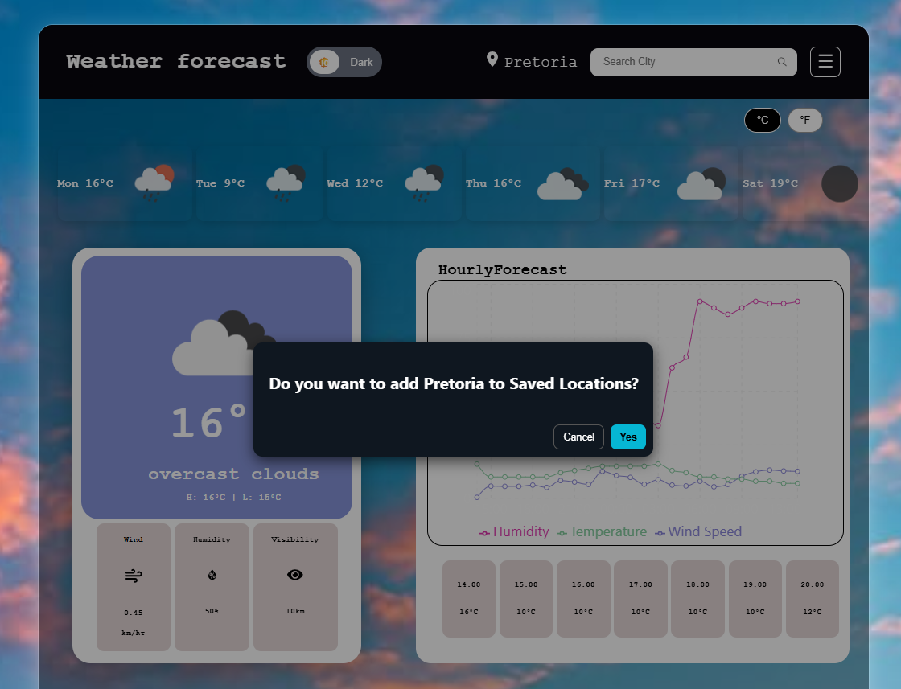
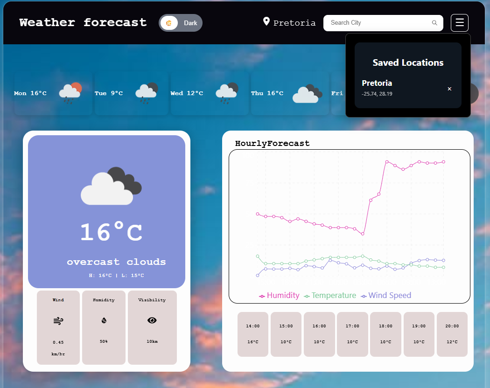

# React Weather App

A modern weather application built with React, TypeScript, and Vite. It allows users to search for a city, view current weather conditions, and manage saved locations for quick access.

## Features

- Search for cities and view live weather information
- Display current weather details in a clean, user-friendly interface
- Save favourite locations for quick access
- Responsive layout for desktop and mobile screens
- Built with React and TypeScript for a smooth development experience

### Links

- **Live Site:** [View Live](react-weather-app-nine-weld.vercel.app)
- **Repository:** [GitHub Repo](https://github.com/Boipelo-85/-React-Weather-App.git)
---
## Tech Stack

- React
- TypeScript
- Vite
- Axios
- Lucide React
- Recharts
- React Router DOM

## Getting Started


### Installation

1. Clone the repository:
   ```bash
   git clone <your-repo-url>
   ```

2. Navigate into the project folder:
   ```bash
   cd react-weather-app
   ```

3. Install dependencies:
   ```bash
   npm install
   ```

### Run the app locally

```bash
npm run dev
```

Then open your browser and visit:

```bash
http://localhost:5173
```

## Project Structure

```bash
src/
  Components/
  Hooks/
  assets/
  App.tsx
  main.tsx
```

## Screenshots

Add your screenshots here:

- Desktop view






- Mobile view


## Notes

This project uses a weather API to fetch real-time weather data. Make sure your API configuration is set up correctly before running the app.

## Author
 
- **Name:** Boipelo Harry Motileng
- **GitHub:** [github.com/boipelo](https://github.com/Boipelo-85)
- **LinkedIn:** [linkedin.com/in/boipelo](https://www.linkedin.com/in/boipelo-motileng)
---